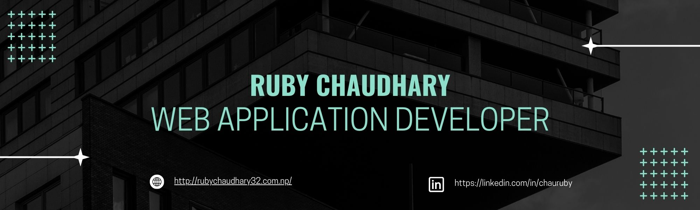

<h1 align="center">Hi 👋, I'm Ruby Chaudhary</h1>
<h3 align="center">A passionate Web Application Designer and Developer</h3>

# 💫 About Me:

<!-- - 🌱 I’m currently preparing for **OSCP certification** -->

- 👯 I’m looking to collaborate on **Web dev projects featuring php and mysql**

- 👨‍💻 All of my projects are available at [Ruby's Github](https://github.com/boseeok)

📄 Know about my experiences chaudharyruby32.com.np

- 💬 Ask me about **php, web development, apache, sql**

- 📫 How to reach me **ruby55879@gmail.com**

- ⚡ Fun fact **I am really into playing Skipping.**

# 💻 Tech Stack:
            

# 📊 GitHub Stats:

<!-- -->
<!-- -->

<!--## 🏆 GitHub Trophies
-->

<!-- 
### 😂 Random Dev Meme

### ✍️ Random Dev Quote
 -->

## 🌐 Socials:
 
